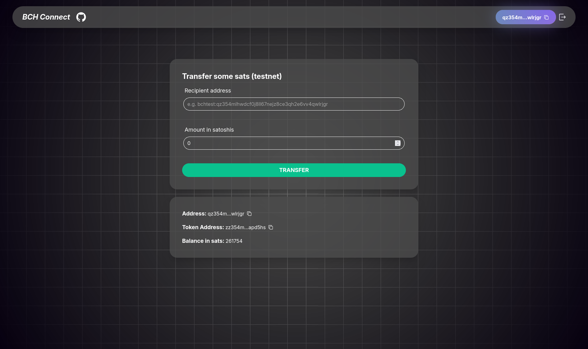

# BCH Connect Example

This is a simple (but beautiful) example demonstrating the library in action.

- In the [`main.tsx`](./src/main.tsx) file, you'll see how the configuration and provider are set up.
- In the [`Example`](./src/components/Example/Example.tsx) component, the library's hooks are used to connect a wallet, read its data, and sign transactions.



## Installation

1. Follow the installation instructions in the root [README](../README.md).
2. Navigate to this `examples` folder and run:

```bash
bun run dev
```

- or replace `bun` with the package manager you were using
